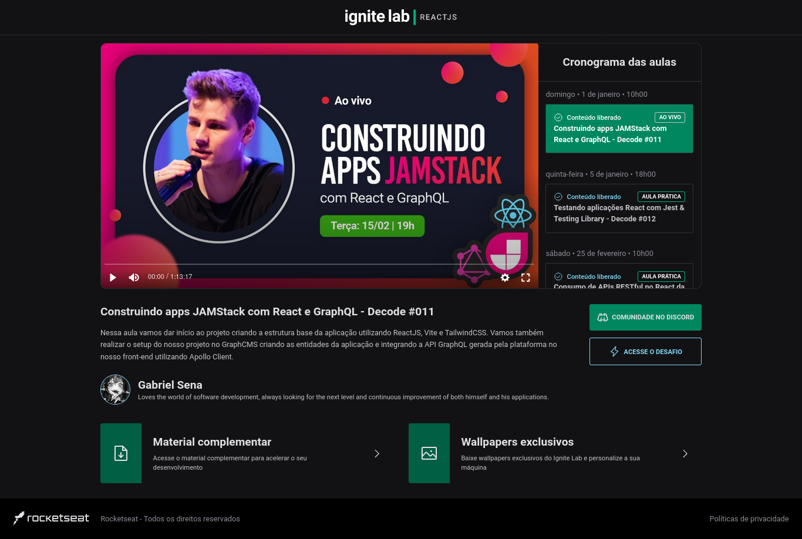

<div align="center">
  
</div>

<h1 align="center">
 Ignite Lab React, Event Platform
</h1>

The project is an event platform that was developed with modern technologies in the frontend and backend. The frontend was developed with React, TypeScript, GraphQL, Hygraph, Apollo Client, Vite and TailwindCSS. The backend was developed with Node.js, TypeScript, Express, Json Web Token, Nodemailer and Nodemon.

The frontend uses React as a framework to build user interfaces, TypeScript to add typing to the code and ensure system integrity, GraphQL as a query language and data manipulation, Hygraph to manage application state, Apollo Client to do GraphQL queries and manage data caching, Vite as a fast and efficient bundler, and TailwindCSS to style the application efficiently.

The backend uses Node.js as a runtime for the server, TypeScript to add typing to the code and ensure system integrity, Express as a framework to build APIs, Json Web Token for user authentication, Nodemailer to send emails from confirmation and Nodemon to automatically restart the server during development.

With these technologies, the project is able to provide an efficient, scalable and secure event platform, with a friendly user interface and an API for email authentication.

## :hammer_and_wrench: Tools

### Frontend

* React
* TypeScript
* GraphQL
* Hygraph (Headless CMS)
* Apollo Client
* Vite
* TailwindCSS

### Backend

* Node.js 
* TypeScript
* Express
* Json Web Token
* Nodemailer
* Nodemon


## :mailbox_with_mail: Utilities
 
### <strong>GraphQL & Hygraph</strong>

CMS (Content Management System) is a system that manages the content of a website, allowing users without technical knowledge to create, edit and publish content. They are often used on sites that have a lot of content or need frequent updates.

Hygraph is a CMS specifically designed to work with GraphQL. It allows developers to define a schema for the GraphQL API, and then use Hygraph to manage the data that will be served by the API. Hygraph has a user-friendly interface for managing data, which makes it easy for CMS users to create and edit content.

The relationship between GraphQL and Hygraph is that GraphQL is used as the API layer for the event platform, while Hygraph is used to manage the data that will be made available through the API. Using GraphQL, you can provide clients with only the data they need, which can significantly improve application performance. Using Hygraph simplifies the content management process, allowing developers to define a GraphQL schema and users to create and edit content directly within the CMS interface. Together, GraphQL and Hygraph can make building an event platform more efficient and scalable.

### <strong>GraphQL Code Generator</strong>

GraphQL Code Generator is a tool that helps automate the development process in GraphQL projects. It automatically generates the necessary code based on the GraphQL schema, making development faster and more productive.

With GraphQL Code Generator, you can automatically generate types, resolvers, queries and mutations, as well as generate code for integration with various languages and frameworks, including TypeScript, React, Angular, Vue.js and many others.

The tool is highly configurable and can be customized according to project needs. Furthermore, it can be easily integrated with other tools such as Apollo Client or Prisma.

In summary, GraphQL Code Generator is an extremely useful tool for developing GraphQL projects, helping to automate the code creation process and improving the team's productivity.

### <strong>Apollo Client</strong>

Apollo Client is a GraphQL client library that simplifies integrating GraphQL into applications. It provides an easy way to retrieve data from a GraphQL server and manage the state of the data on the client.

The Apollo Client is highly configurable and can be integrated with various state management frameworks such as Redux and MobX. It also provides advanced features such as cache normalization which helps to avoid data duplication on the client and reduces network traffic.

Additionally, Apollo Client provides powerful development tools such as Apollo DevTools that allow you to easily view and debug GraphQL queries and client cache state.

In summary, Apollo Client is a useful library for developers who want to work with GraphQL in their applications and want an easy way to manage client state and retrieve data from the server.

## :speech_balloon: Explanations

### Apollo Client - a GraphQL Client

Apollo Client is a full caching GraphQL client with integrations for React, Angular and more. It allows you to easily build UI components that fetch data through GraphQL.

Apollo Client is a comprehensive state management library for JavaScript that enables you to manage both local and remote data with GraphQL. Use it to fetch, cache, and modify application data, all while automatically updating your UI.

Apollo Client helps you structure code in an economical, predictable, and declarative way that's consistent with modern development practices. The core `@apollo/client` library provides built-in integration with React, and the larger Apollo community maintains integrations for other popular view layers.

#### Step 1: Install dependencies

Applications that use Apollo Client require two top-level dependencies:

 - `@apollo/client`: This single package contains virtually everything you need to set up Apollo Client. It includes the in-memory cache, local state management, error handling, and a React-based view layer.
 - `graphql`: This package provides logic for parsing GraphQL queries.

Run the following command to install both of these packages:

 - `npm install @apollo/client graphql`
 
#### Step 2: Initialize ApolloClient

With our dependencies set up, we can now initialize an `ApolloClient` instance.

In `apollo.ts`, let's first import the symbols we need from @apollo/client and next we'll initialize ApolloClient, passing its constructor a configuration object with the uri and cache fields:

```ts
import { ApolloClient, InMemoryCache } from '@apollo/client'

export const client = new ApolloClient({
  uri: import.meta.env.VITE_API_URL,
  headers: {
    'Authorization': `Bearer ${import.meta.env.VITE_API_ACCESS_TOKEN}`
  },
  cache: new InMemoryCache(),
})
```

 - <strong>uri</strong> specifies the URL of our GraphQL server.
 - <strong>cache</strong> is an instance of InMemoryCache, which Apollo Client uses to cache query results after fetching them.

That's it! Our client is ready to start fetching data. 

#### Step 3: Connect your client to React

You connect Apollo Client to React with the ApolloProvider component. Similar to React's `Context.Provider`, ApolloProvider wraps your React app and places Apollo Client on the context, enabling you to access it from anywhere in your component tree.

In `App.tsx`, let's wrap our React app with an ApolloProvider. We suggest putting the ApolloProvider somewhere high in your app, above any component that might need to access GraphQL data.

```tsx
import { ApolloProvider } from '@apollo/client'
import { BrowserRouter } from 'react-router-dom'
import { client } from './lib/apollo'
import { Router } from './Router'

export const hostServer = import.meta.env.VITE_SERVER

function App() {
  return (
    <ApolloProvider client={client}>
      <BrowserRouter>
        <Router />
      </BrowserRouter>
    </ApolloProvider>
  )
}

export default App
```

#### Executing a query

The `useQuery` React hook is the primary API for executing queries in an Apollo application. To run a query within a React component, call useQuery and pass it a GraphQL query string. When your component renders, useQuery returns an object from Apollo Client that contains loading, error, and data properties you can use to render your UI.

Let's look at an example. First, we'll create a GraphQL query named `GET_DOGS`. Remember to wrap query strings in the `gql` function to parse them into query documents and next, we'll create a component named `Dogs`. Inside it, we'll pass our `GET_DOGS query` to the useQuery hook:

```jsx
import { gql, useQuery } from '@apollo/client'

const GET_DOGS = gql`
  query GetDogs {
    dogs {
      id
      breed
    }
  }
`

function Dogs({ onDogSelected }) {
  const { loading, error, data } = useQuery(GET_DOGS)
  if (loading) return 'Loading...'
  if (error) return `Error! ${error.message}`

  return (
    <select name='dog' onChange={onDogSelected}>
      {data.dogs.map((dog) => (
        <option key={dog.id} value={dog.breed}>
          {dog.breed}
        </option>
      ))}
    </select>
  )
}
```

As our query executes and the values of loading, error, and data change, the Dogs component can intelligently render different UI elements according to the query's state:

 - As long as `loading` is `true` (indicating the query is still in flight), the component presents a `Loading...` notice.
 - When loading is `false` and there is no `error`, the query has completed. The component renders a dropdown menu that's populated with the list of dog breeds returned by the server.

When the user selects a dog breed from the populated dropdown, the selection is sent to the parent component via the provided onDogSelected function.

#### Refetching

Refetching enables you to refresh query results in response to a particular user action, as opposed to using a fixed interval.

Let's add a button to our `DogPhoto` component that calls our query's `refetch` function whenever it's clicked.

You can optionally provide a new `variables` object to the `refetch` function. If you avoid passing a `variables` object and use only `refetch()`, the query uses the same variables that it used in its previous execution.

```jsx
function DogPhoto({ breed }) {
  const { loading, error, data, refetch } = useQuery(GET_DOG_PHOTO, {
    variables: { breed },
  })

  if (loading) return null
  if (error) return `Error! ${error}`

  return (
    <div>
      
      <button onClick={() => refetch({ breed: 'new_dog_breed' })}>
        Refetch new breed!
      </button>
    </div>
  )
}
```

#### Mutations - Modify data with the useMutation hook

Now that we've learned how to query data from our backend with Apollo Client, the natural next step is to learn how to modify back-end data with mutations.

The `useMutation` React hook is the primary API for executing mutations in an Apollo application.

To execute a mutation, you first call useMutation within a React component and pass it the mutation you want to execute, like so:

```jsx
import { gql, useMutation } from '@apollo/client'

// Define mutation
const INCREMENT_COUNTER = gql`
  # Increments a back-end counter and gets its resulting value
  mutation IncrementCounter {
    currentValue
  }
`

function MyComponent() {
  // Pass mutation to useMutation
  const [mutateFunction, { data, loading, error }] = useMutation(INCREMENT_COUNTER);
}
```

As shown above, you use the gql function to parse the mutation string into a GraphQL document that you then pass to useMutation.

Let's say we're creating a to-do list application and we want the user to be able to add items to their list. First, we'll create a corresponding GraphQL mutation named `ADD_TODO`. Remember to wrap GraphQL strings in the `gql` function to parse them into query documents and next, we'll create a component named `AddTodo` that represents the submission form for the to-do list. Inside it, we'll pass our `ADD_TODO` mutation to the `useMutation` hook:

```jsx
import { gql, useMutation } from '@apollo/client'
const ADD_TODO = gql`
  mutation AddTodo($type: String!) {
    addTodo(type: $type) {
      id
      type
    }
  }
`

function AddTodo() {
  let input
  const [addTodo, { data, loading, error }] = useMutation(ADD_TODO)

  if (loading) return 'Submitting...'
  if (error) return `Submission error! ${error.message}`

  return (
    <div>
      <form
        onSubmit={e => {
          e.preventDefault()
          addTodo({ variables: { type: input.value } })
          input.value = ''
        }}
      >
        <input
          ref={node => {
            input = node
          }}
        />
        <button type="submit">Add Todo</button>
      </form>
    </div>
  )
}
```

In this example, our form's `onSubmit` handler calls the `mutate function` (named addTodo) that's returned by the `useMutation` hook. This tells Apollo Client to execute the mutation by sending it to our GraphQL server.

<br />

### GraphQL Code Generator | Generating types from a GraphQL schema 

GraphQL uses a type system to clearly define the available data for each type and field in a GraphQL schema. Type generation libraries can take advantage of the strongly-typed nature of a GraphQL schema to automatically generate TypeScript types based on that schema.

You can use these generated TS types in your resolvers to type-check that your resolvers' return values match the field types dictated by your schema. Type checking your resolvers enables you to catch errors quickly and gives you the peace of mind that type safety ensures.

#### Installing and configuring dependencies

Run the following command to install the `@graphql-codegen/cli`, `@graphql-codegen/typescript`, `@graphql-codegen/typescript-operations`, `@graphql-codegen/typescript-react-apollo`, packages into your project's dev dependencies:

 - `npm i @graphql-codegen/cli @graphql-codegen/typescript @graphql-codegen/typescript-operations @graphql-codegen/typescript-react-apollo`

Most client-side implementations without GraphQL Code Generator would query the API as showcased in the following examples:

```graphql
# src/graphql/queries/get-lessons-query.graphql

query GetLessons {
  lessons(orderBy: availableAt_ASC, stage: PUBLISHED) {
    id
    lessonType
    availableAt
    title
    slug
  }
}
```

Next, we'll set up a configuration file to tell GraphQL Code Generator where and how to generate types. You can do this by manually creating a `codegen.yml` file or by using the following command, which walks you through the process:

 - `npx graphql-codegen`
 
Below is an example of a codegen.yml file:

```yml
// codegen.yml

schema: https://api-us-west-2.graphcms.com/v2/cl4o0fph100jc01xr0iruejj1/master
documents: './src/graphql/**/*.graphql'
generates:
  ./src/graphql/generated.ts:
    plugins:
      - typescript
      - typescript-operations
      - typescript-react-apollo
    config:
      reactApolloVersion: 3
      withHooks: true
      withHOC: false
      withComponent: false
```

Finally, we recommend adding helpful scripts to your package.json file to ensure your TS types are regularly generated:

```json
{
"scripts": {
    "codegen": "graphql-codegen"
  }
}
```

Now, with simple configuration and an npm/yarn script, a front-end developers benefits from:

 - up-to-date typings
 - autocompletion on all queries, mutations and, subscription variables and results
 - less boilerplate (thanks to full code generation such as React hooks generation)
 

 
<p align="center">Project made with :blue_heart: by <a href="https://github.com/stardusteight-d4c">Gabriel Sena</a></p>

