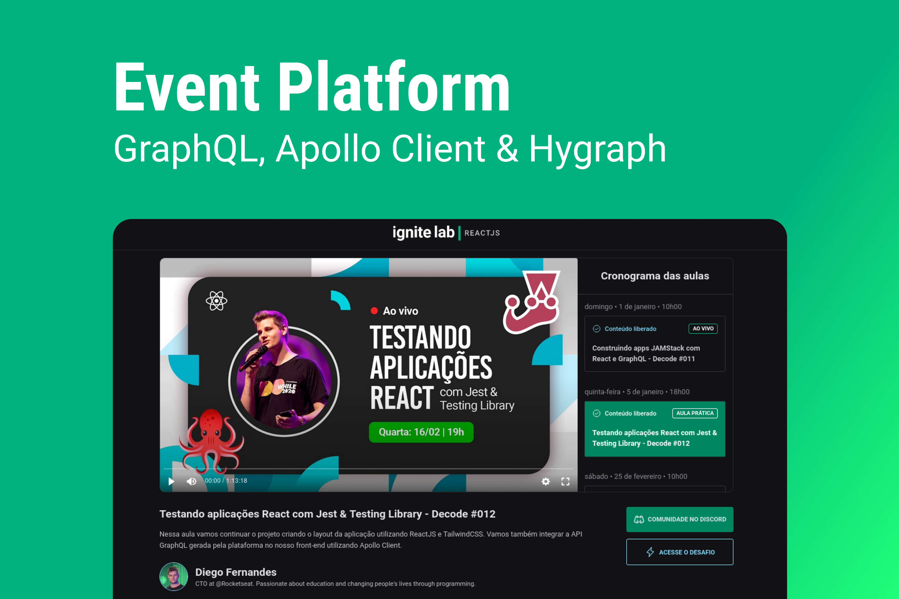
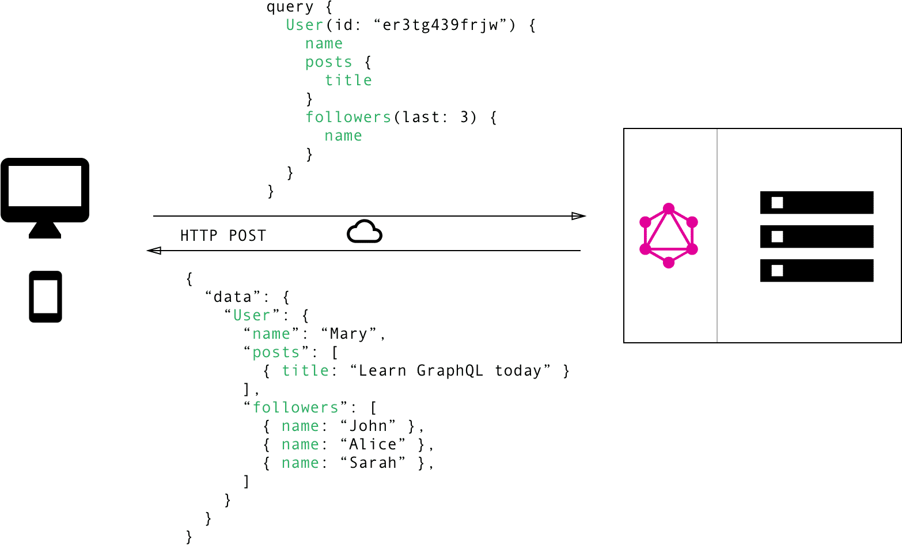

# Event Platform | GraphQL, Apollo Client & Hygraph



> Project carried out at `Ignite Lab | React.js`, an event held by Rocketseat where we experiment and test new technologies that are
> market trends. This time we built an `Events Platform`, where people will be able to sign up and see the Lessons that are made available
> on specific days and times of the month, the application is integrated with a `Content Management System, Hygraph`, to manage the content of classes
> of the event, as well as its participants. Requests are made with `GraphQL` (a query language created by Facebook), and with `Apollo
> Client` we optimize state management and use it to fetch, cache and modify application data while updating
> automatically your UI.

:arrow_right: GraphQL | A query language for your API <br /> 
:arrow_right: Apollo Client - a GraphQL Client <br /> 
:arrow_right: GraphQL Code Generator | Generating types from a GraphQL schema <br /> 
:arrow_right: Hygraph | Headless CMS <br />

<br />

## GraphQL | A query language for your API 

`GraphQL is a server-oriented query language and runtime environment` for application programming interfaces (APIs) whose priority is `to provide exactly the data clients request` and nothing else.

GraphQL was developed to make `APIs faster, more flexible and intuitive for developers`. You can even deploy it in an integrated development environment (IDE) known as `GraphiQL`. As an `alternative to the REST architecture`, GraphQL allows developers to build requests that pull data from multiple sources in a single API call.

Additionally, GraphQL gives API maintainers the flexibility to add or deprecate fields without affecting existing queries. Developers can build APIs with any method they want, as the GraphQL specification ensures that they work predictably for clients.

<div align="center">

</div>

### Ask for what you need, get exactly that

Send a GraphQL query to your API and get exactly what you need, nothing more and nothing less. GraphQL queries always return predictable results. `Apps using GraphQL are fast and stable because they control the data they get, not the server`.

### Get many resources in a single request

`GraphQL queries access not just the properties of one resource but also smoothly follow references between them. While typical REST APIs require loading from multiple URLs, GraphQL APIs get all the data your app needs in a single request`. Apps using GraphQL can be quick even on slow mobile network connections.

### Describe what’s possible with a type system

`GraphQL APIs are organized in terms of types and fields, not endpoints. Access the full capabilities of your data from a single endpoint`. GraphQL uses types to ensure Apps only ask for what’s possible and provide clear and helpful errors. Apps can use types to avoid writing manual parsing code.

### Move faster with powerful developer tools

`Know exactly what data you can request from your API without leaving your editor`, highlight potential issues before sending a query, and take advantage of improved code intelligence. GraphQL makes it easy to build powerful tools like `GraphiQL` by leveraging your API’s type system.

*<i>redhat.com/en/topics/api/what-is-graphql</i> <br />
*<i>graphql.org</i> <br />

<br />

## Apollo Client - a GraphQL Client

Apollo Client is a full caching GraphQL client with integrations for React, Angular and more. `It allows you to easily build UI components that fetch data through GraphQL`.

Apollo Client is a comprehensive state management library for JavaScript that enables you to manage both local and remote data with GraphQL. `Use it to fetch, cache, and modify application data, all while automatically updating your UI`.

`Apollo Client helps you structure code in an economical, predictable, and declarative way that's consistent with modern development practices`. The core `@apollo/client` library provides built-in integration with React, and the larger Apollo community maintains integrations for other popular view layers.

### Step 1: Install dependencies

Applications that use Apollo Client require two top-level dependencies:

 - <strong>@apollo/client</strong>: This single package contains virtually everything you need to set up Apollo Client. It includes the in-memory cache, local state management, error handling, and a React-based view layer.
 - <strong>graphql</strong>: This package provides logic for parsing GraphQL queries.

Run the following command to install both of these packages:

 - `npm install @apollo/client graphql`
 
### Step 2: Initialize ApolloClient

With our dependencies set up, we can now initialize an `ApolloClient` instance.

In `apollo.ts`, let's first import the symbols we need from @apollo/client and next we'll initialize ApolloClient, passing its constructor a configuration object with the `uri` and `cache` fields:

```ts
import { ApolloClient, InMemoryCache } from '@apollo/client'

export const client = new ApolloClient({
  uri: import.meta.env.VITE_API_URL,
  headers: {
    'Authorization': `Bearer ${import.meta.env.VITE_API_ACCESS_TOKEN}`
  },
  cache: new InMemoryCache(),
})
```

 - <strong>uri</strong> specifies the URL of our GraphQL server.
 - <strong>cache</strong> is an instance of InMemoryCache, which Apollo Client uses to cache query results after fetching them.

That's it! Our client is ready to start fetching data. 

### Step 3: Connect your client to React

You connect Apollo Client to React with the `ApolloProvider` component. Similar to React's `Context.Provider`, ApolloProvider `wraps your React app` and places Apollo Client on the context, enabling you to access it from anywhere in your component tree.

In `App.tsx`, let's wrap our React app with an ApolloProvider. We suggest putting the ApolloProvider somewhere high in your app, above any component that might need to access GraphQL data.

```tsx
import { ApolloProvider } from '@apollo/client'
import { BrowserRouter } from 'react-router-dom'
import { client } from './lib/apollo'
import { Router } from './Router'

export const hostServer = import.meta.env.VITE_SERVER

function App() {
  return (
    <ApolloProvider client={client}>
      <BrowserRouter>
        <Router />
      </BrowserRouter>
    </ApolloProvider>
  )
}

export default App
```

### Executing a query

The `useQuery` React hook is the primary API for executing queries in an Apollo application. To run a query within a React component, `call useQuery and pass it a GraphQL query string`. When your component renders, useQuery returns an object from Apollo Client that contains `loading, error, and data properties` you can use to render your UI.

Let's look at an example. First, we'll create a GraphQL query named `GET_DOGS`. Remember to wrap query strings in the `gql` function to parse them into query documents and next, we'll create a component named `Dogs`. Inside it, we'll pass our `GET_DOGS query` to the useQuery hook:

```jsx
import { gql, useQuery } from '@apollo/client'

const GET_DOGS = gql`
  query GetDogs {
    dogs {
      id
      breed
    }
  }
`

function Dogs({ onDogSelected }) {
  const { loading, error, data } = useQuery(GET_DOGS)
  if (loading) return 'Loading...'
  if (error) return `Error! ${error.message}`

  return (
    <select name='dog' onChange={onDogSelected}>
      {data.dogs.map((dog) => (
        <option key={dog.id} value={dog.breed}>
          {dog.breed}
        </option>
      ))}
    </select>
  )
}
```

As our query executes and the values of `loading, error, and data change, the Dogs component can intelligently render different UI elements according to the query's state`:

 - As long as `loading` is `true` (indicating the query is still in flight), the component presents a `Loading...` notice.
 - When loading is `false` and there is no `error`, the query has completed. The component renders a dropdown menu that's populated with the list of dog breeds returned by the server.

When the user selects a dog breed from the populated dropdown, the selection is sent to the parent component via the provided onDogSelected function.

#### Refetching

`Refetching enables you to refresh query results in response to a particular user action`, as opposed to using a fixed interval.

Let's add a button to our `DogPhoto` component that calls our query's `refetch` function whenever it's clicked.

You can optionally provide a new `variables` object to the `refetch` function. If you avoid passing a `variables` object and use only `refetch()`, the query uses the same variables that it used in its previous execution.

```jsx
function DogPhoto({ breed }) {
  const { loading, error, data, refetch } = useQuery(GET_DOG_PHOTO, {
    variables: { breed },
  })

  if (loading) return null
  if (error) return `Error! ${error}`

  return (
    <div>
      
      <button onClick={() => refetch({ breed: 'new_dog_breed' })}>
        Refetch new breed!
      </button>
    </div>
  )
}
```

### Mutations - Modify data with the useMutation hook

Now that we've learned how to query data from our backend with Apollo Client, the natural next step is to learn how to `modify back-end data with mutations`.

The `useMutation` React hook is the primary API for executing mutations in an Apollo application.

To execute a mutation, `you first call useMutation within a React component and pass it the mutation you want to execute`, like so:

```jsx
import { gql, useMutation } from '@apollo/client'

// Define mutation
const INCREMENT_COUNTER = gql`
  # Increments a back-end counter and gets its resulting value
  mutation IncrementCounter {
    currentValue
  }
`

function MyComponent() {
  // Pass mutation to useMutation
  const [mutateFunction, { data, loading, error }] = useMutation(INCREMENT_COUNTER);
}
```

As shown above, you use the `gql function to parse the mutation string into a GraphQL document that you then pass to useMutation`.

Let's say we're creating a to-do list application and we want the user to be able to add items to their list. First, we'll create a corresponding GraphQL mutation named `ADD_TODO`. Remember to wrap GraphQL strings in the `gql` function to parse them into query documents and next, we'll create a component named `AddTodo` that represents the submission form for the to-do list. Inside it, we'll pass our `ADD_TODO` mutation to the `useMutation` hook:

```jsx
import { gql, useMutation } from '@apollo/client'
const ADD_TODO = gql`
  mutation AddTodo($type: String!) {
    addTodo(type: $type) {
      id
      type
    }
  }
`

function AddTodo() {
  let input
  const [addTodo, { data, loading, error }] = useMutation(ADD_TODO)

  if (loading) return 'Submitting...'
  if (error) return `Submission error! ${error.message}`

  return (
    <div>
      <form
        onSubmit={e => {
          e.preventDefault()
          addTodo({ variables: { type: input.value } })
          input.value = ''
        }}
      >
        <input
          ref={node => {
            input = node
          }}
        />
        <button type="submit">Add Todo</button>
      </form>
    </div>
  )
}
```

In this example, our form's `onSubmit` handler calls the `mutate function` (named addTodo) that's returned by the `useMutation` hook. This tells Apollo Client to execute the mutation by sending it to our GraphQL server.

*<i>apollographql.com/docs/react/get-started</i> <br />
*<i>apollographql.com/docs/react/data/queries</i> <br />
*<i>apollographql.com/docs/react/data/mutations</i> <br />
