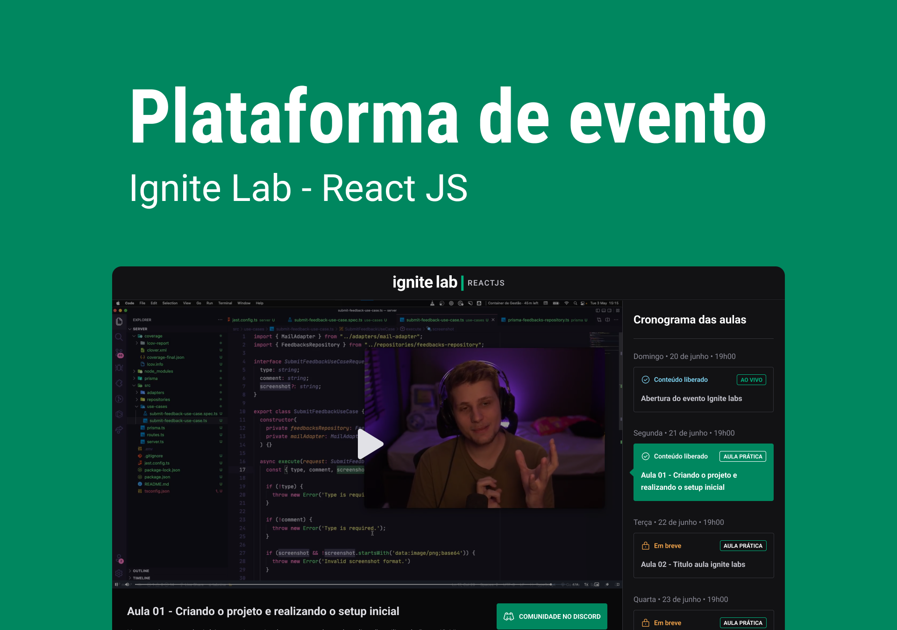

# Ignite Lab | Event Platform

> Creation of an events platform, where subscribers can have access to several videos registered on the platform.
> The project was created at the Ignite Lab event and we worked with several technologies with a focus on React and GraphQL,
> in which we use GraphCMS to create the application's entities and integrate the GraphQL API generated by the platform to our front-end using Apollo Client.
> A CMS is a Content Management System, used to create, edit, manage and publish content on digital platforms, allowing it to be modified, removed and added without the need to know the HTML markup language.

- `npm create vite@latest`
- To use Tailwindcss with Vite, install it with the following dependencies: `npm i tailwindcss postcss autoprefixer -D`
- And to create the Postcss configuration file: `npx tailwindcss init -p`
